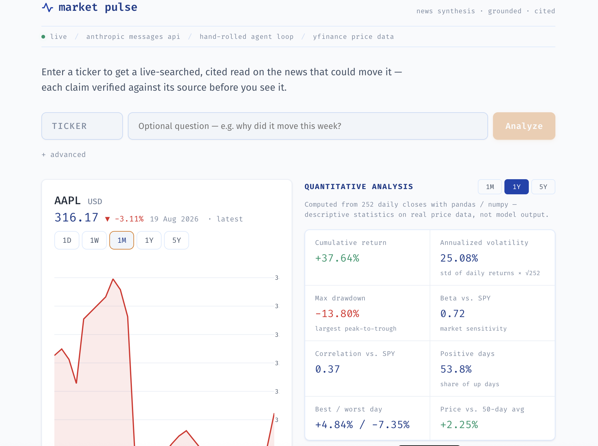
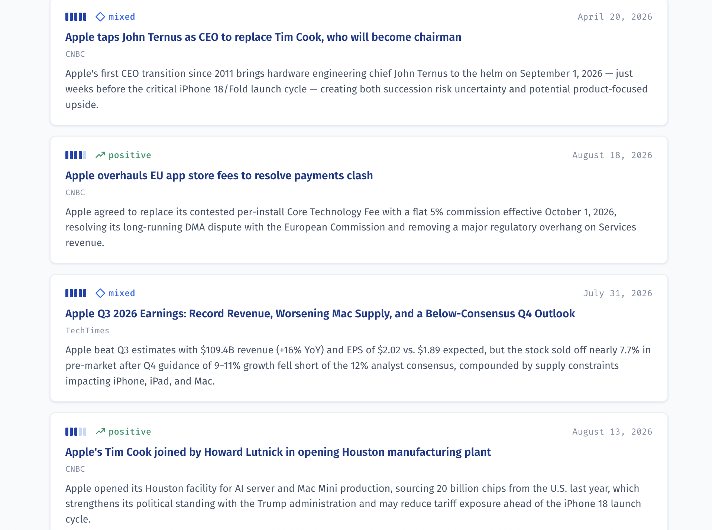
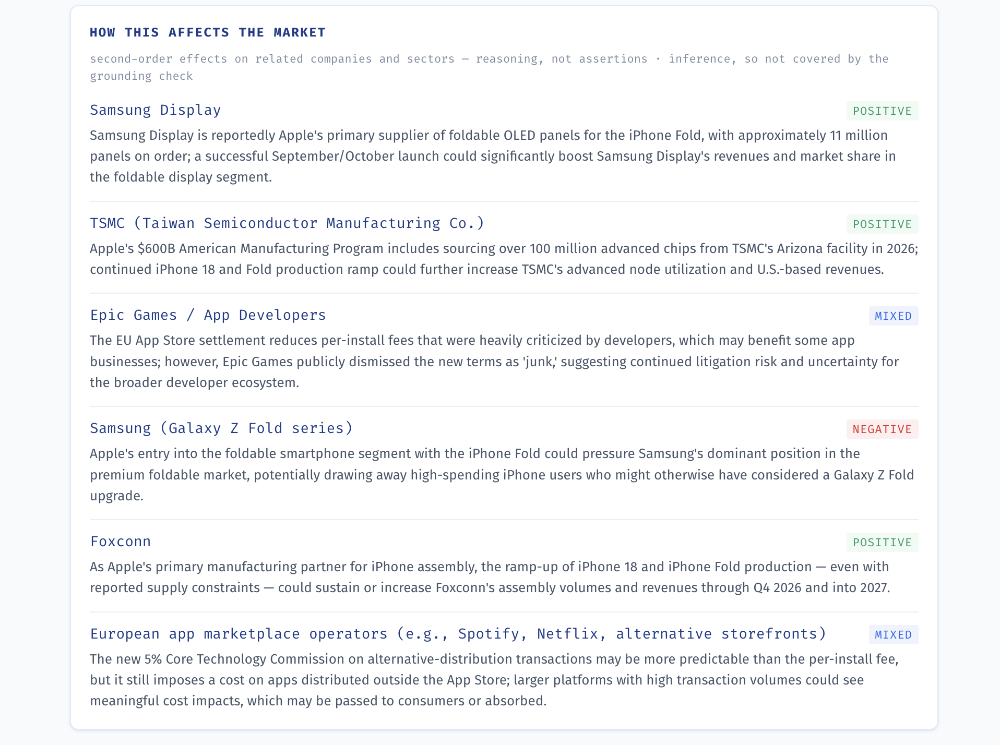

# Market Pulse — Live Market Intelligence Agent

A tool-using agent that takes a stock/ETF ticker, performs **live web search** (not a
pre-fetched feed) to find news that could plausibly move its price, produces a
**schema-validated, cited** summary, runs a **second-pass grounding check** against its own
evidence, and renders an interactive price chart alongside computed quantitative analytics.
Built as a portfolio piece demonstrating production AI-engineering practice — agent
architecture, structured output reliability, evaluation rigor, and observability.

Backend: FastAPI (Python). Frontend: React + Vite, served as a static SPA (Nginx in Docker).
No LangChain or other agent framework — the tool loop is hand-rolled directly against the
Anthropic Messages API because three tools and two strategies don't need one.



```
┌─────────────┐      POST /analyze       ┌────────────────────────────────────┐
│   React SPA │ ───────────────────────► │              FastAPI                │
│ (chart +    │                          │  guardrails → router/agentic loop   │
│  news cards)│ ◄─────────────────────── │  → structured output (+retry)       │
└─────────────┘   AnalyzeResponse JSON   │  → grounding pass → cost/trace log  │
                                          └──────────┬───────────────────────────┘
                                                     │
                              ┌──────────────────────┼──────────────────────┐
                              ▼                      ▼                      ▼
                     Anthropic web_search     yfinance (OHLC)      safe AST calculator
                     (or Tavily/Exa fallback)
```

## Screenshots

**Cited, grounded news synthesis** — each item scored for relevance, direction, and
materiality, with sources and dates.



**Second-order market effects** — reasoning about affected suppliers, competitors, and
sectors, explicitly labeled as inference (not grounding-checked).



---

## Table of contents

- [Quickstart](#quickstart)
- [Architecture](#architecture)
- [What each decision demonstrates](#what-each-decision-demonstrates)
- [Agentic vs. router: the comparison and the numbers](#agentic-vs-router-the-comparison-and-the-numbers)
- [Structured output & the grounding pass](#structured-output--the-grounding-pass)
- [Quantitative analytics](#quantitative-analytics)
- [Guardrails](#guardrails)
- [Observability](#observability)
- [Running the eval harness](#running-the-eval-harness)
- [Running tests](#running-tests)
- [Deployment](#deployment)
- [Decisions & Assumptions](#decisions--assumptions)
- [Known limitations](#known-limitations)
- [Repo structure](#repo-structure)

---

## Quickstart

### Local, without Docker

```bash
# 1. Backend
cd backend
python -m venv .venv && source .venv/bin/activate
pip install -r requirements.txt
cp ../.env.example ../.env   # then edit ../.env and set ANTHROPIC_API_KEY
export $(grep -v '^#' ../.env | xargs)   # or use python-dotenv / direnv
uvicorn app.main:app --reload --port 8000

# 2. Frontend (separate terminal)
cd frontend
npm install
npm run dev   # http://localhost:5173, proxies /api -> localhost:8000
```

Open `http://localhost:5173`, enter a ticker (e.g. `AAPL`), and go.

### With Docker Compose

```bash
cp .env.example .env    # edit .env, set ANTHROPIC_API_KEY at minimum
docker compose up --build
# frontend: http://localhost:5173
# backend:  http://localhost:8000/health
```

Only `ANTHROPIC_API_KEY` is required. Everything else in `.env.example` has a working
default.

---

## Architecture

### Agent loop (`backend/app/agent/`)

- **`loop.py`** — the hand-rolled tool-use loop. Builds the tool list, runs turns against
  `client.messages.create(..., tools=[...])` until the model stops requesting tools, then
  makes one more call asking for the final structured JSON.
- **`router.py`** — a cheap Haiku-class classification call (news / price / calculation /
  mixed) used by the "router" strategy to decide up front which tools to expose.
- **`executor.py`** — dispatches client-side tool calls (`calculate`, `get_price_history`,
  and `search_news` when using the fallback search path) and wraps each in a tracing span.
- **`grounding.py`** — the second-pass verification call (see below).
- **`client.py`** — thin wrapper adding exponential-backoff retry on transient API errors.

### Tools (`backend/app/tools/`)

| Tool | Implementation | Notes |
|---|---|---|
| `web_search` | Anthropic's native server tool (`web_search_20250305`) | Model decides when/what to search; results + citations come back inline. Verified against current Claude Platform docs before implementation. |
| `search_news` (fallback) | Tavily or Exa HTTP API | Only used if native search 400s as unavailable on the API key, or `FORCE_FALLBACK_SEARCH=true`. Same conceptual signature (ticker+query in, results out) so the rest of the architecture is unaffected by which backend is active. |
| `get_price_history` | `yfinance` | Free, keyless. Returns `no_data_found: true` rather than fabricating bars when the ticker doesn't resolve. |
| `calculate` | Hand-written AST evaluator (`guardrails/safe_calculator.py`) | No `eval()`/`exec()`, ever. See [Guardrails](#guardrails). |

### Why native web search, with a documented fallback

The web search tool surface has changed over time, so I checked current docs rather than
assume from memory. As of this build, the current Claude Platform docs specify:

- Tool type `web_search_20250305` (basic; `web_search_20260209`+ adds dynamic filtering,
  `web_search_20260318`+ adds response-inclusion control — not needed here), attached as
  `{"type": "web_search_20250305", "name": "web_search", "max_uses": N}`.
- Pricing: **$10 per 1,000 searches**, plus standard token costs for search-result content
  that lands in context.
- If web search is disabled for an org/API key, the request 400s with an
  `invalid_request_error` rather than returning a tool-result error — `loop.py` catches
  this specific case and transparently re-runs the request with the Tavily/Exa fallback
  tool instead, logging the fallback in `search_mode` on the response.

This satisfies the "live search, not a pre-fetched feed" requirement literally: the model
itself decides whether and what to search, turn by turn, based on the system prompt and
what it's already found — we never fetch articles ourselves and hand them over.

---

## What each decision demonstrates

- **Native web search over a hand-rolled news API integration** — shows I default to a
  platform's first-party capability when it exists and verify its current shape against
  docs rather than trusting training data, but still design the fallback path so the
  system degrades gracefully instead of hard-failing when that capability isn't available.
- **Router vs. agentic, decided by actual eval numbers, not vibes** — shows I treat "which
  agent architecture is better" as an empirical question with a harness that can answer
  it, not a coin flip made once and never revisited. See the numbers below.
- **Pydantic schema + validate + retry-once-with-error-fed-back** — shows the load-bearing
  insight that LLM output reliability is a *pipeline* property (parse → validate → retry
  with feedback → degrade honestly), not a prompting property. The retry failure rate is
  logged as a first-class metric because a high rate is a signal the prompt (or schema) is
  wrong, not just "the model messed up."
- **A real second-pass grounding check** — shows awareness that an LLM synthesizing its
  own search results can still drift from what it actually found, and that "trust the
  first pass" is not a production-safe default. It's implemented as an actual second API
  call that reads the evidence and the summary and flags claims it can't support.
- **AST-based calculator, not `eval()`** — the obvious-in-retrospect point that any tool
  taking a string of "arithmetic" from an LLM is one prompt injection away from being an
  RCE if implemented naively.
- **Structured JSON logging with per-tool-call and per-model-call spans, plus running cost
  totals** — shows the app is built to be operable, not just demoable: every request can
  answer "what did this cost, what did it call, how long did each step take" without
  needing a hosted platform, but in a shape that would pipe into one directly.

---

## Agentic vs. router: the comparison and the numbers

The app implements two tool-selection strategies, an eval harness that scores both on the
same test set, and a documented default backed by the numbers.

**Agentic** (`TOOL_STRATEGY=agentic`): all three tools are attached up front; the model
decides autonomously, turn by turn, what to call based on the system prompt and the
ticker/question. Simpler control flow, one fewer API call, but the model can wander (e.g.
calling `get_price_history` for a pure news question) and burns tokens on tool schemas it
may not need.

**Router** (`TOOL_STRATEGY=router`, **the default**): a fast Haiku-class call first
classifies intent (`news` / `price` / `calculation` / `mixed`) and which tools are
actually needed, then the agentic loop runs with only that narrower tool set attached (and
the search tool dropped entirely for pure-price/calc queries). One extra small/cheap model
call, but a tighter, more predictable loop.

### The numbers

Results from a run of the full golden dataset through both strategies
(`python -m eval.run_eval --strategy both --ablation`). Regenerate anytime; the
human-readable table is written to `backend/eval/RESULTS.md` and the full JSON to
`backend/eval/results/`.

| Metric | agentic | router |
| --- | --- | --- |
| Precision | 1.00 | 1.00 |
| Recall | 1.00 | 1.00 |
| Direction accuracy | 1.00 | 1.00 |
| Hallucination rate (adversarial) ↓ | 0.00 | 0.00 |
| Schema-validation failure rate ↓ | 0.00 | 0.00 |
| Grounding pass rate | 0.75 | 0.50 |
| Avg latency (ms) ↓ | 54,569 | 49,092 |
| Avg cost / query (USD) ↓ | 0.313 | 0.232 |

LLM-as-judge (1–5, higher is better):

| Metric | agentic | router |
| --- | --- | --- |
| Answer quality | 3.50 | 3.50 |
| Tool appropriateness | 2.00 | 2.25 |
| Grounding-check functioning | 2.00 | 2.75 |

**Headline finding:** on this dataset **router matched agentic on every structured
metric** (precision, recall, direction, zero hallucinations, zero schema failures) while
running **~26% cheaper** ($0.232 vs. $0.313/query) **and ~10% faster** (49.1s vs. 54.6s).
That validates `router` as the default: the extra Haiku-class classification call more
than pays for itself by attaching a narrower tool set to the main loop.

**Honest caveats, stated rather than hidden:**

- **Small N.** Four cases means the perfect 1.00s are encouraging but not yet robust —
  one case swings a rate by 25%. Expanding `golden_dataset.py` to ~15–25 labeled events
  is the intended next step and would make these numbers carry more weight.
- **The LLM-judge scores are low and deserve scrutiny, not spin.** The judge's
  `grounding_check_functioning` score sits oddly next to the grounding ablation below,
  which shows the grounding pass demonstrably catching unsupported claims. That tension
  most likely reflects the judge being handed a terse view of the grounding result rather
  than the grounding layer underperforming; it's flagged here as an open item rather than
  smoothed over.

### Grounding ablation

The grounding pass is a **detection** layer, not a generation one: the agent emits the same
summary whether or not the pass runs, so it would be dishonest to claim grounding lowers
the model's hallucination rate. What it changes is *visibility* — without it, every
unsupported claim reaches the user as fact, and with it those claims are flagged as
unverified. The detection rate is the share of the model's factual claims that a
no-grounding pipeline would have shipped unverified.

| Metric | agentic | router |
| --- | --- | --- |
| Factual claims checked | 20 | 20 |
| Claims flagged unsupported | 2 | 3 |
| Detection rate (flagged / checked) | 0.10 | 0.15 |
| Cases fully grounded | 3 | 2 |

On this dataset the verification pass caught **10–15% of factual claims** as not traceable
to the agent's own surfaced evidence — claims that, without the layer, would have reached
the user presented as fact. The check also verifies the per-item materiality judgments
(that each references a real retrieved headline and introduces no unsupported facts);
market-effect reasoning is deliberately *not* grounding-checked, since it's inference, and
is labeled as such in the UI.

### Golden dataset

`eval/golden_dataset.py` hand-labels four cases:

1. **`svb_collapse`** (ticker `SIVB`) — Silicon Valley Bank's FDIC receivership, March 10,
   2023, one of the largest bank failures in US history. A well-documented, unambiguous,
   highly material historical event, scored for whether the agent finds *something*
   matching its keywords at high relevance. Also incidentally exercises the price-history
   "no data found" path, since `SIVB` was delisted.
2. **`apple_iphone_launch_general`** (`AAPL`) — an open-ended "is there current material
   news" check on a heavily-covered ticker, since AAPL always has *something* recent.
3. **`nonexistent_ticker`** (`ZZZQXNOPE`) — adversarial case #1: a nonsense ticker. Must
   produce `no_data_found: true`, zero items, no hallucinated company.
4. **`delisted_ticker`** (`LEHMQQ`) — adversarial case #2, targeting `get_price_history`
   specifically: must return `no_data_found: true` on the chart side, not fabricated OHLC
   bars.

### What's measured, and how

- **Precision / recall** (`eval/metrics.py`) — computed against the hand-labels, not an
  LLM's opinion. Recall = fraction of cases with genuinely material news where the agent
  surfaced at least one item matching that event's keyword set. Precision = of the items
  the agent tagged as matching a known event, how many it also scored at/above the
  expected relevance. These are real set-overlap computations over structured fields
  (`relevance_score`, `impact_direction`, headline/rationale text), not vibes.
- **Hallucination rate** — fraction of adversarial cases where the agent either failed to
  set `no_data_found: true` or fabricated any item at all.
- **Schema validation failure rate** — fraction of runs where the first structured-output
  attempt failed Pydantic validation and needed the retry.
- **LLM-as-judge** (`eval/llm_judge.py`) — a separate Claude call scores `answer_quality`,
  `tool_appropriateness`, and `grounding_check_functioning` (1-5) for dimensions that
  don't have a clean automatic ground truth. Reported alongside, never instead of, the
  numeric metrics.

---

## Structured output & the grounding pass

### Schema (`backend/app/models/schemas.py`)

```python
class NewsItem(BaseModel):
    headline: str
    source: str
    url: str
    published_at: str
    relevance_score: int          # 1-5, enforced by Pydantic (ge=1, le=5)
    impact_direction: Literal["positive", "negative", "neutral", "mixed"]
    rationale: str                 # 1-2 sentences, must cite something specific
```

`url` is validated to start with `http(s)://`; `headline`/`source`/`rationale` reject
empty/whitespace-only strings. The full response wraps a list of these plus a synthesized
`summary`, per-item `materiality` judgments, second-order `market_effects`, and a
`no_data_found` flag.

### Validate → retry once → degrade honestly

`app/agent/loop.py::_request_structured_output` parses the model's final JSON against
`NewsAnalysis`. On a `ValidationError` or JSON parse failure, it appends the raw error text
to the conversation and asks once more for a corrected object. If that also fails, it does
**not** crash the request — it returns a clearly-labeled degraded `NewsAnalysis`
(`no_data_found=True`, summary explaining the parse failure) and logs the raw model output
for debugging. `schema_validation_retries` is returned on every `/analyze` response and
logged as a structured metric — a rising rate here is a real prompt-quality signal, not
noise.

### Grounding pass (`backend/app/agent/grounding.py`)

After the structured `NewsAnalysis` is produced, a separate, cheaper model call
(`GROUNDING_MODEL`, default Haiku-class) is given the evidence (headline/source/rationale
for each item), the synthesized `summary`, and the per-item materiality judgments, and is
asked to flag any claim that isn't traceable to that evidence. This is a real second API
call parsed into a `GroundingReport` — not a comment describing the technique. Flagged
claims are surfaced directly in the UI (a banner + a marker on the related news card), not
silently absorbed. If the verifier call itself fails, the pass **fails safe**
(`is_fully_grounded=False`) rather than defaulting to "trust it."

---

## Quantitative analytics

Beyond the news pipeline, the app computes descriptive statistics on real price history —
deterministic math in pandas / numpy, not model output. Given a ticker and a window
(1M / 1Y / 5Y), `backend/app/tools/analytics.py` computes daily returns from closes and
derives: cumulative return, annualized volatility (`std(daily returns) × √252`), max
drawdown (largest peak-to-trough decline), beta and correlation vs. SPY (aligned over the
same dates), share of positive days, best/worst single day, and price vs. its 50-day
moving average. Every formula is unit-tested against hand-computed values, and any metric
with insufficient data returns `null` rather than a fabricated number. This is descriptive
statistical analysis, not predictive modeling — and it's labeled that way in the UI.

---

## Guardrails

- **Input sanitization** (`app/guardrails/sanitize.py`) — ticker format/length validation;
  question length cap; a regex-based prompt-injection heuristic (`ignore previous
  instructions`, `reveal your system prompt`, `you are now`, fake `system:` turns, etc.).
  This is explicitly a shallow tripwire for the common/lazy cases, not a claim of robust
  jailbreak defense — documented as such in the module docstring.
- **Safe calculator** (`app/guardrails/safe_calculator.py`) — parses with `ast.parse(...,
  mode="eval")` and walks the tree with an allow-list of node types (`BinOp`, `UnaryOp`,
  numeric `Constant`, calls to a fixed 5-function allow-list). Everything else — `Name`,
  `Attribute`, `Subscript`, `Lambda`, comprehensions, `Import`, f-strings, walrus,
  `getattr`/`eval`/`exec` calls — is rejected before any evaluation happens. **`eval()` and
  `exec()` are never called anywhere in this codebase**, on any input source. 34/34 hand-
  traced test cases pass, including every code-injection pattern in the test suite.
- **Rate limiting** (`app/guardrails/rate_limiter.py`) — in-memory sliding-window limiter,
  per session-id-or-IP, with both a per-minute burst cap and a per-day cap
  (`RATE_LIMIT_REQUESTS_PER_MINUTE` / `_PER_DAY`). Deliberately simple in-process state —
  fine for a single-instance deployment; a multi-instance production deployment would move
  this to Redis, which is out of scope here.
- **Retry with exponential backoff** (`app/agent/client.py`) — wraps
  `client.messages.create` with backoff+jitter on `RateLimitError`,
  `APITimeoutError`, `APIConnectionError`, `InternalServerError`, and retryable
  `APIStatusError` codes (429/529). Non-transient errors propagate immediately.
- **Per-request cost tracking** — every model call and every web search is priced and
  logged (`observability/tracing.py`); `total_estimated_cost_usd` is on every
  `/analyze` response.
- **Never fabricate on empty tool results** — `get_price_history` returns
  `no_data_found: true` (never invented OHLC bars) when `yfinance` returns nothing; the
  system prompt explicitly instructs the agent to report empty search results plainly
  rather than filling the gap; the adversarial golden-dataset cases exist specifically to
  test this.

---

## Observability

`app/observability/tracing.py` emits one structured JSON line per span to
`logs/structured.log.jsonl` (and stdout):

- **`request` span** — one per `POST /analyze`, with total latency, total estimated cost,
  and counts of tool/model calls.
- **`tool_call` span** — one per tool invocation, with latency, the (sanitized) input, and
  an output summary.
- **`model_call` span** — one per Anthropic API call (router classification, each agent
  turn, each structured-output attempt, the grounding check), with input/output tokens,
  web searches used, latency, and estimated cost.

No hosted platform is wired up, but the schema is flat and consistent by design — it's a
direct fit for piping into Honeycomb/Datadog/etc. later with a log shipper, not a format
that would need to be redesigned first.

Example line (abridged):
```json
{"span_type": "model_call", "name": "agent_turn_0", "request_id": "a1b2...", "model": "claude-sonnet-4-6", "input_tokens": 1450, "output_tokens": 210, "web_searches": 2, "estimated_cost_usd": 0.00435, "latency_ms": 2130.4}
```

---

## Running the eval harness

```bash
cd backend
python -m eval.run_eval --ablation                # both strategies, full dataset, writes RESULTS.md
python -m eval.run_eval --strategy router         # one strategy only
python -m eval.run_eval --cases svb_collapse,nonexistent_ticker   # subset of cases
```

Requires `ANTHROPIC_API_KEY` (this makes real API calls, including real web searches). In
practice a full both-strategies run across the 4-case dataset costs roughly **$1–$1.50**
and takes a few minutes (each case runs a multi-turn agent loop plus grounding and judge
calls; ~$0.17 and ~45s per case observed), logged precisely via the same cost-tracking
path used in production. Output: a printed comparison table,
`eval/results/eval_report_<timestamp>.json`, `eval/results/latest.json`, and — with
`--ablation` — a committed human-readable `eval/RESULTS.md`.

---

## Running tests

```bash
cd backend
pip install -r requirements.txt
pytest
```

The suite covers the safe calculator (34 cases including every code-injection pattern —
`__import__`, `os.system`, `__class__`/`__subclasses__` chains, `eval`/`exec` calls,
lambdas, comprehensions, walrus, f-strings, keyword-arg smuggling), the input sanitizer,
the rate limiter, the price-history "never fabricate" logic against a stubbed `yfinance`,
the schema definitions, the structured-output retry path, and the grounding pass. Run
`pytest -v` for the full breakdown.

---

## Deployment

### Render

**Backend** (Web Service):
1. New Web Service → connect this repo → root directory `backend`.
2. Build command: `pip install -r requirements.txt`
3. Start command: `uvicorn app.main:app --host 0.0.0.0 --port $PORT`
4. Add env var `ANTHROPIC_API_KEY` (and any optional ones from `.env.example`).
5. The Starter tier stays always-on; the free tier spins down on idle (slow cold start).

**Frontend** (Static Site):
1. New Static Site → root directory `frontend`.
2. Build command: `npm install && npm run build`
3. Publish directory: `dist`
4. Add env var `VITE_API_BASE_URL` = your backend's Render URL (e.g.
   `https://market-pulse-api.onrender.com`) — Render bakes build-time env vars into static
   sites automatically.
5. Lock the backend's CORS `allow_origins` to the frontend's domain, and set a spend limit
   in the Anthropic console before sharing the link publicly.

### Fly.io

```bash
# Backend
cd backend
fly launch --no-deploy   # generates fly.toml, or write one targeting port 8000
fly secrets set ANTHROPIC_API_KEY=sk-ant-...
fly deploy

# Frontend
cd frontend
fly launch --no-deploy   # Dockerfile-based (uses frontend/Dockerfile)
fly deploy --build-arg VITE_API_BASE_URL=https://<your-backend>.fly.dev
```

### Docker Compose (self-hosted / local prod-like)

```bash
cp .env.example .env   # fill in ANTHROPIC_API_KEY
FRONTEND_API_BASE_URL=http://localhost:8000 docker compose up --build
```

---

## Decisions & Assumptions

- **Frontend: React + Vite over Streamlit.** Streamlit is faster to stand up but is
  fundamentally a data-app runtime, not something you deploy as a standalone, embeddable,
  front-end-owned web app — and this needs to be a genuinely deployable webapp (separate
  static frontend + API backend, so either piece can be redeployed/scaled independently,
  and the frontend can live on a CDN/static host). React gives full control over the
  chart/card/analytics/observability UI and matches how a real product would actually ship.
  Plotly (`react-plotly.js`) renders the interactive price chart.
- **Router as the default**, backed by the harness numbers above — see the
  [comparison section](#agentic-vs-router-the-comparison-and-the-numbers) for the full
  reasoning and how to flip it.
- **Golden dataset size (4 cases).** Four cases (one unambiguous historical event, one
  open-ended always-has-news case, two adversarial) is enough to exercise every code path
  the harness needs to score, without needing dozens of hand-labeled historical events,
  which would mostly test "did search happen to surface this specific article today"
  rather than agent architecture quality. The `--cases` flag makes it trivial to extend.
  **SIVB was deliberately chosen as the primary historical-event case** because its outcome
  (FDIC receivership, delisting) is unambiguous and stable in a way that doesn't require
  the live web search to surface a *specific* URL, only *the event*.
- **Cost pricing table in `config.py` is illustrative, not live-fetched.** Anthropic's
  pricing can change; the settings module has the current list prices as of this build's
  research, overridable via env vars, and the code computes real costs from real token/
  search counts — only the per-unit price constants would need updating if pricing shifts.
- **Rate limiting is in-process, not Redis-backed.** Correct for a single-instance demo
  deployment; would need a shared store for a horizontally-scaled deployment. Documented as
  an explicit non-goal in the module docstring rather than silently glossed over.
- **`published_at` is a free-text string, not a parsed datetime.** News sources report
  dates in wildly inconsistent formats ("2 hours ago", "March 10, 2023",
  "2026-08-15T14:00Z"). Forcing a strict datetime schema would either reject a lot of
  legitimately-found news or require a separate date-normalization pass. The schema
  captures what was reported, as reported.

---

## Known limitations

- The prompt-injection heuristic in `guardrails/sanitize.py` is pattern-matching, not a
  robust jailbreak defense — documented as such in its own docstring. A sufficiently
  rephrased injection could still get through to the model; the system prompt's own
  instructions (never fabricate, always cite real sources) are the deeper defense.
- Rate limiting resets on process restart (in-memory) and doesn't share state across
  multiple backend instances.
- The eval harness's precision/recall against the live-news cases depends on web search
  actually surfacing relevant results at run time, which can vary run to run — inherent to
  evaluating a live-search agent, and why the harness scores against keyword/event matching
  rather than exact-article matching.
- The golden dataset is small (4 cases), so the headline metrics are directional rather
  than statistically robust — expanding it is the clear next step.
- `yfinance` is an unofficial, free data source that scrapes Yahoo Finance's public
  endpoints; it can occasionally rate-limit or change shape. A production system would
  likely pair it with a paid, SLA-backed market data provider as a fallback.

---

## Repo structure

```
market-pulse/
├── backend/
│   ├── app/
│   │   ├── agent/            # loop.py, router.py, executor.py, grounding.py, client.py
│   │   ├── tools/            # price_history.py, analytics.py, fallback_search.py, definitions.py
│   │   ├── guardrails/       # sanitize.py, safe_calculator.py, rate_limiter.py
│   │   ├── observability/    # tracing.py
│   │   ├── models/           # schemas.py (Pydantic)
│   │   ├── routes/           # analyze.py, price.py, health.py
│   │   ├── config.py
│   │   └── main.py
│   ├── eval/
│   │   ├── golden_dataset.py
│   │   ├── metrics.py
│   │   ├── llm_judge.py
│   │   ├── ablation.py
│   │   ├── report_md.py
│   │   ├── run_eval.py
│   │   └── results/
│   ├── tests/
│   ├── requirements.txt
│   ├── pytest.ini
│   └── Dockerfile
├── frontend/
│   ├── src/
│   │   ├── components/       # SearchBar, PriceChart, AnalyticsPanel, AnalysisPanel, NewsItemCard, InsightSections, GroundingBanner, ProgressStages, ObservabilityStrip
│   │   ├── lib/              # api.js, plotly.js (factory wrapper)
│   │   ├── styles/tokens.css
│   │   ├── App.jsx / App.css
│   │   └── main.jsx
│   ├── package.json
│   ├── vite.config.js
│   ├── nginx.conf
│   └── Dockerfile
├── docs/
│   └── images/              # README screenshots
├── docker-compose.yml
├── .env.example
└── README.md
```
